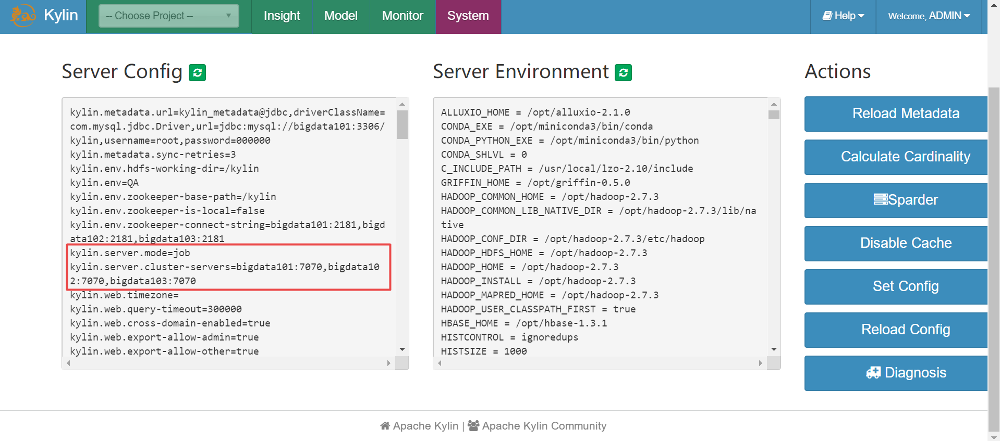

# kylin4 集群安装

[TOC]

### 1 单机安装

按照 [安装指南](https://kylin.apache.org/cn/docs/install/index.html) 安装。

注意：要提前在 mysql 中创建数据库 kylin

```
kylin.metadata.url=kylin_metadata@jdbc,driverClassName=com.mysql.cj.jdbc.Driver,url=jdbc:mysql://bigdata101:3306/kylin,username=root,password=root

kylin.env.zookeeper-connect-string=localhost
```

先启动 hadoop hive zookeeper

### 2 集群安装

在单节点基础上，给 kylin.properties 添加如下配置，并分发到其他节点。

配置三个节点的环境变量。

```sh
# bigdata101节点
[root@bigdata101 kylin-4.0.1]# vi conf/kylin.properties 
kylin.metadata.url=kylin_metadata@jdbc,driverClassName=com.mysql.jdbc.Driver,url=jdbc:mysql://bigdata101:3306/kylin,username=root,password=000000

kylin.env.zookeeper-connect-string=bigdata101:2181,bigdata102:2181,bigdata103:2181


kylin.server.cluster-servers=bigdata101:7070,bigdata102:7070,bigdata103:7070

kylin.server.mode=job
```

```sh
# bigdata102节点
[root@bigdata102 kylin-4.0.1]# vi conf/kylin.properties 
kylin.metadata.url=kylin_metadata@jdbc,driverClassName=com.mysql.jdbc.Driver,url=jdbc:mysql://bigdata101:3306/kylin,username=root,password=000000

kylin.env.zookeeper-connect-string=bigdata101:2181,bigdata102:2181,bigdata103:2181


kylin.server.cluster-servers=bigdata101:7070,bigdata102:7070,bigdata103:7070

kylin.server.mode=query
```

```sh
# bigdata103节点
[root@bigdata103 kylin-4.0.1]# vi conf/kylin.properties 
kylin.metadata.url=kylin_metadata@jdbc,driverClassName=com.mysql.jdbc.Driver,url=jdbc:mysql://bigdata101:3306/kylin,username=root,password=000000

kylin.env.zookeeper-connect-string=bigdata101:2181,bigdata102:2181,bigdata103:2181


kylin.server.cluster-servers=bigdata101:7070,bigdata102:7070,bigdata103:7070

kylin.server.mode=query
```

检查环境

```sh
[root@bigdata101 kylin-4.0.1]# bin/check-env.sh
Retrieving hadoop conf dir...
...................................................[PASS]
KYLIN_HOME is set to /opt/kylin-4.0.1
Checking hive
...................................................[PASS]
Checking hadoop shell
...................................................[PASS]
Checking hdfs working dir
2022-01-15 18:03:52,905 WARN  [main] util.NativeCodeLoader (NativeCodeLoader.java:<clinit>(62)) - Unable to load native-hadoop library for your platform... using builtin-java classes where applicable
...................................................[PASS]
2022-01-15 18:03:54,753 WARN  [main] util.NativeCodeLoader (NativeCodeLoader.java:<clinit>(62)) - Unable to load native-hadoop library for your platform... using builtin-java classes where applicable
2022-01-15 18:03:56,279 WARN  [main] util.NativeCodeLoader (NativeCodeLoader.java:<clinit>(62)) - Unable to load native-hadoop library for your platform... using builtin-java classes where applicable

Checking environment finished successfully. To check again, run 'bin/check-env.sh' manually.
```

启动

```sh
[root@bigdata101 kylin-4.0.1]# bin/kylin.sh start
Retrieving hadoop conf dir...
...................................................[PASS]
KYLIN_HOME is set to /opt/kylin-4.0.1
Checking hive
...................................................[PASS]
Checking hadoop shell
...................................................[PASS]
Checking hdfs working dir
2022-01-15 18:04:24,968 WARN  [main] util.NativeCodeLoader (NativeCodeLoader.java:<clinit>(62)) - Unable to load native-hadoop library for your platform... using builtin-java classes where applicable
...................................................[PASS]
2022-01-15 18:04:26,440 WARN  [main] util.NativeCodeLoader (NativeCodeLoader.java:<clinit>(62)) - Unable to load native-hadoop library for your platform... using builtin-java classes where applicable
2022-01-15 18:04:27,893 WARN  [main] util.NativeCodeLoader (NativeCodeLoader.java:<clinit>(62)) - Unable to load native-hadoop library for your platform... using builtin-java classes where applicable

Checking environment finished successfully. To check again, run 'bin/check-env.sh' manually.
Retrieving hadoop conf dir...
Retrieving Spark dependency...
Skip spark which not owned by kylin. SPARK_HOME is /opt/spark-2.2.1 and KYLIN_HOME is /opt/kylin-4.0.1.
  Please download the correct version of Apache Spark, unzip it, rename it to 'spark' and put it in /opt/kylin-4.0.1 directory.
  Do not use the spark that comes with your hadoop environment.
  If your hadoop environment is cdh6.x, you need to do some additional operations in advance.
  Please refer to the link: https://cwiki.apache.org/confluence/display/KYLIN/Deploy+Kylin+4+on+CDH+6.
Start to check whether we need to migrate acl tables
Not HBase metadata. Skip check.

A new Kylin instance is started by root. To stop it, run 'kylin.sh stop'
Check the log at /opt/kylin-4.0.1/logs/kylin.log
Web UI is at http://bigdata101:7070/kylin
```

可以在 web 页面查看系统配置属性项



### 3 任务引擎高可用

在集群模式的基础上，

将 bigdata103 节点的 `kylin.server.mode` 属性修改为 `job`。

在三个节点的 `kylin.properties` 中添加如下配置。

```sh
kylin.job.scheduler.default=2
kylin.job.lock=org.apache.kylin.job.lock.zookeeper.ZookeeperJobLock
```

### 4 问题

如果没有配置 `kylin.env.zookeeper-connect-string` 属性，会出现如下的问题：

```
ERROR [localhost-startStop-1] curator.ConnectionState:228 : Connection timed out for connection string (sandbox.hortonworks.com/kylin/kylin_metadata) and timeout (15000) / elapsed (92606)
org.apache.curator.CuratorConnectionLossException: KeeperErrorCode = ConnectionLoss
```