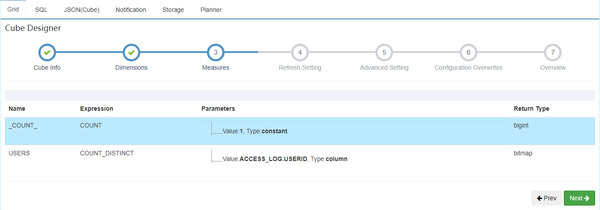

# 使用 kylin 计算留存率


这里采用的是在 docker 中运行 kylin 的模式，kylin 版本为 3.1.0。

-----------------------------------------------------------------------

[TOC]

### 1 准备数据

表 access_log 数据源

```
# dt,userid,page

20190101,100,index.html
20190101,101,search.html
20190101,102,detail.html

20190102,100,index.html
20190102,102,detail.html
20190102,103,index.html

20190103,101,index.html
```

建表

```sql
create table access_log(
  dt int,
  userid int,
  page string
)
row format delimited
fields terminated by ',';
```

导入数据

```sql
load data local inpath '/home/admin/data/access_log.txt' into table access_log;
```

### 2 kylin构建cube

建模型


建 cube





度量的数据类型设置为 bitmap

### 3 执行查询

#### UV

```sql
select dt, count(distinct userid) 
from access_log 
where dt >= '20190101' and dt <= '20190103' 
group by dt 
```


#### 留存分析

以日留存为例，要计算第一天访问的用户中，有多少在第二天、第三天继续访问了 app。如果使用 HiveQL 或 Spark SQL 来计算第一天和第二天的留存用户数，写法大致如下：

```sql
SELECT count(distinct first_day.USER_ID) 
FROM (
  select distinct USER_ID as USER_ID 
  from access_log 
  where DT = '20190101') as first_day 
INNER JOIN (
  select distinct USER_ID as USER_ID 
  from access_log 
  where DT = '20190102') as second_day 
ON first_day.USER_ID = second_day.USER_ID
```

使用 kylin 计算日／周／月留存，其实拿这几日访问用户的 bitmap，相互做与 `and` 操作，就可以高效地得到留存数字，如 `第一天 and 第二天 `访问的用户；这样跟第一天的访问用户数做个比较，就可以计算出第二天留存率等。

关于 intersect_count 的详细描述见：[https://kylin.apache.org/blog/2016/11/28/intersect-count/](https://kylin.apache.org/blog/2016/11/28/intersect-count/)

```sql
select intersect_count(userid, dt, array['20190101', '20190102']) 
from
access_log 
where dt in ('20190101', '20190102');

-- INTERSECT_VALUE 可以返回具体值
select INTERSECT_VALUE(userid, dt, array['20190101', '20190102']) 
from
access_log 
where dt in ('20190101', '20190102');
```


通过 kylin 还可以很方便地在一条 SQL 中查询多日的 UV 及留存，避免反复查询

```sql
select city, version, 
    intersect_count(userid, dt, array['20161014']) as first_day_uv, 
    intersect_count(userid, dt, array['20161015']) as second_day_uv, 
    intersect_count(userid, dt, array['20161016']) as third_day_uv, 
    intersect_count(userid, dt, array['20161014', '20161015']) as retention_oneday, 
    intersect_count(userid, dt, array['20161014', '20161016']) as retention_twoday 
from access_log 
where dt in ('2016104', '20161015', '20161016') 
group by city, version 
order by city, version;
```

同理，如果 cube 中有周、月做维度，那么这里把日期换成周、月就可以很方便地计算周留存、月留存了。


#### 漏斗分析

使用前面的数据和模型，再构建一个 cube


```sql
select intersect_count(userid, page, array['index.html']) as first_step_uv, 
    intersect_count(userid, page, array['search.html']) as second_step_uv, 
    intersect_count(userid, page, array['detail.html']) as third_step_uv, 
    intersect_count(userid, page, array['index.html', 'search.html']) as retention_one_two, 
    intersect_count(userid, page, array['search.html','detail.html']) as retention_two_three 
from access_log 
where dt in('20190101', '20190102', '20190103');
```


当然这是一个很简单的例子，实际会复杂很多；这里的 page（页面）可以换成埋点值或其它维度，从而更加细致地分析各种行为之间的关联关系。


**多维度滑动的留存分析、用户画像分析、用户明细分析见原文** **【TODO】**


----------------------------

原文：[https://www.sohu.com/a/347842047_659643](https://www.sohu.com/a/347842047_659643)

更多理解：[https://zhuanlan.zhihu.com/p/73519718](https://zhuanlan.zhihu.com/p/73519718)