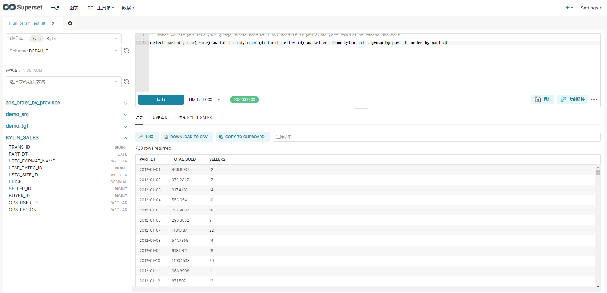

# 集成superset进行可视化

参考：[https://kylin.apache.org/blog/2018/01/01/kylin-and-superset/](https://kylin.apache.org/blog/2018/01/01/kylin-and-superset/)

注意：

1.要使用 pip 安装 kylinpy，不要使用 conda

2.注意更改 `kylin://<username>:<password>@<hostname>:<port>/<project name>` 中的 project name

3.好像不用在 中添加 `数据-->数据集` 中添加数据集，可以直接在编辑器中查询。



4.测试SQL

```sql
select YEAR_BEG_DT,
MONTH_BEG_DT,
WEEK_BEG_DT,
META_CATEG_NAME,
CATEG_LVL2_NAME,
CATEG_LVL3_NAME,
OPS_REGION,
NAME as BUYER_COUNTRY_NAME,
sum(PRICE) as GMV,
sum(ACCOUNT_BUYER_LEVEL) ACCOUNT_BUYER_LEVEL,
count(*) as CNT
from KYLIN_SALES
join KYLIN_CAL_DT on CAL_DT=PART_DT
join KYLIN_CATEGORY_GROUPINGS on SITE_ID=LSTG_SITE_ID and KYLIN_CATEGORY_GROUPINGS.LEAF_CATEG_ID=KYLIN_SALES.LEAF_CATEG_ID join KYLIN_ACCOUNT on ACCOUNT_ID=BUYER_ID
join KYLIN_COUNTRY on ACCOUNT_COUNTRY=COUNTRY
group by YEAR_BEG_DT, MONTH_BEG_DT, WEEK_BEG_DT, META_CATEG_NAME, CATEG_LVL2_NAME, CATEG_LVL3_NAME, OPS_REGION, NAME
```